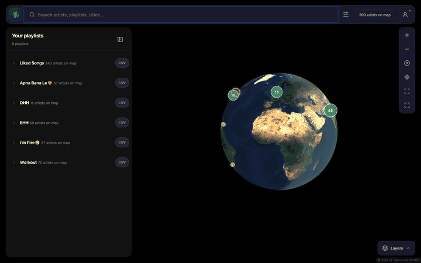
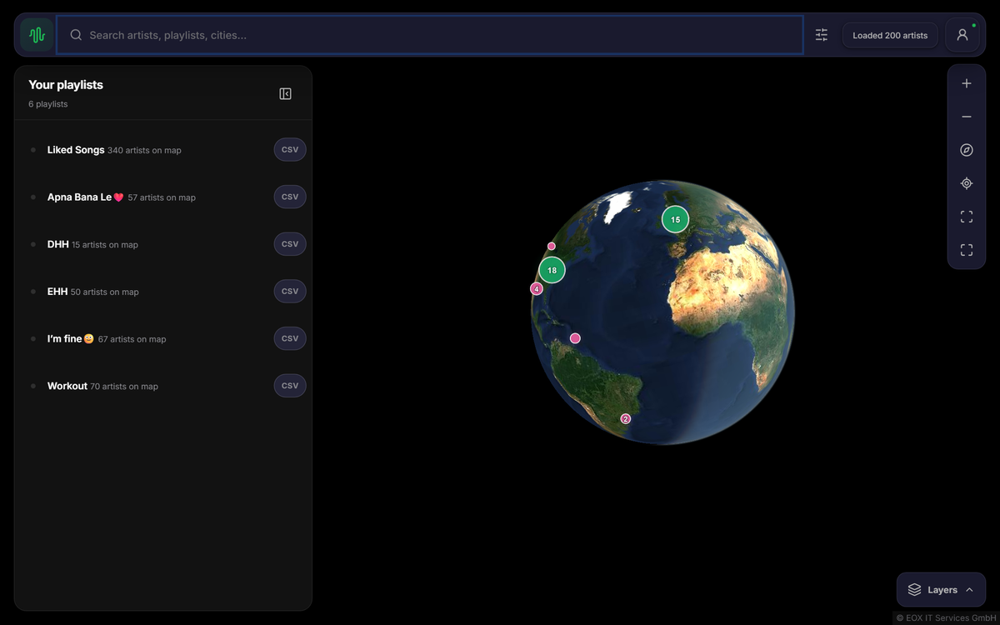
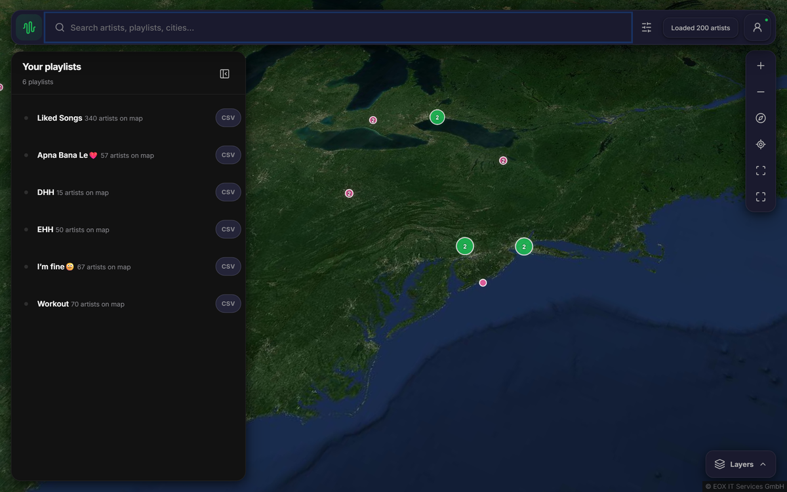
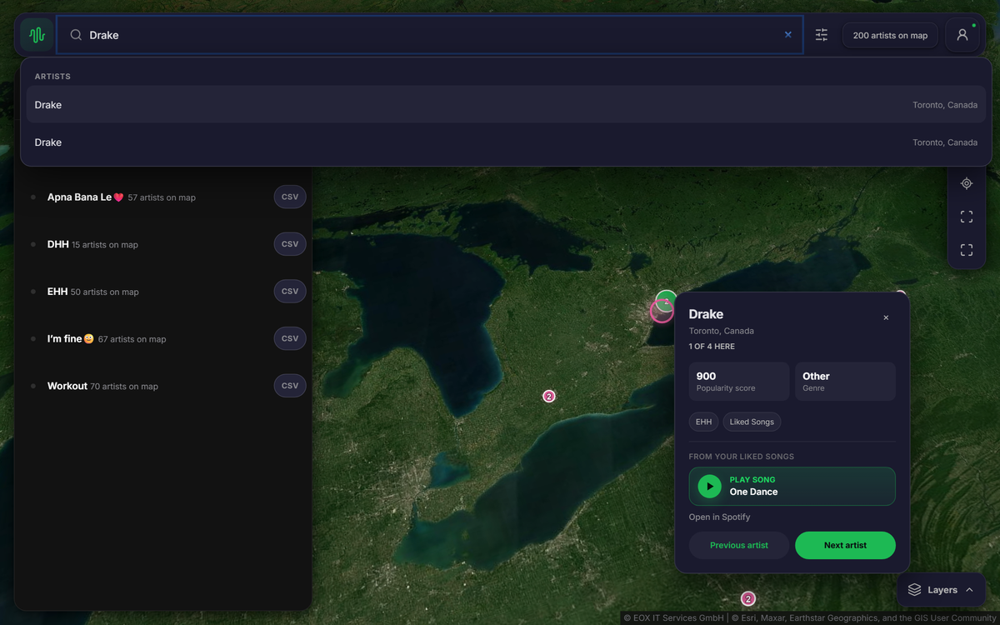

<p align="center">
  
  
  
  
</p>

# Sonic Cartography

**See where your music comes from.** Sonic Cartography connects to your Spotify library and maps every artist to their real-world origin&mdash;birthplace for solo artists, formation city for bands&mdash;on a beautiful interactive globe.

<p align="center">
  <a href="#quick-start"></a>
</p>

<p align="center">
  
</p>

<table>
  <tr>
    <td align="center" width="33%"><br><sub><b>Globe view</b></sub></td>
    <td align="center" width="33%"><br><sub><b>Cluster view</b></sub></td>
    <td align="center" width="33%"><br><sub><b>Artist detail card</b></sub></td>
  </tr>
</table>

---

## What it does

Connect your Spotify account and watch your taste spread across the world. Every artist in your Liked Songs and playlists gets pinned to the city they came from, colored by genre, and grouped into clusters you can explore.

### Key features

- **Interactive globe & map** &mdash; Three map styles: satellite globe with atmosphere, vector street map, and clean minimal. Smooth zoom from space down to street level.
- **Automatic playlist pulling** &mdash; One click fetches your Liked Songs and all owned/collaborative playlists with smart rate-limit retry and backoff.
- **Genre-colored markers** &mdash; 10 genre buckets (Hip-Hop, R&B/Soul, Pop, Indie, Rock, Electronic, Jazz, Reggae, Afrobeats, Latin) each with a distinct color.
- **Clustering** &mdash; Nearby artists group into clusters that expand as you zoom in. Heatmap overlay shows density at a glance.
- **Search & filter** &mdash; Search by artist name, city, country, playlist, or genre. Filter by multiple dimensions simultaneously.
- **Artist detail cards** &mdash; Click any pin to see the artist's origin, genre, playlists, and play their liked track directly in the browser.
- **Arc visualization** &mdash; Toggle arcs from each artist's origin to your home location.
- **Auto-spin globe** &mdash; Hands-free spinning globe to showcase your map.
- **CSV import/export** &mdash; Import [Exportify](https://exportify.net)-compatible CSVs or export your own. Merge multiple sources onto one map.
- **Fully responsive** &mdash; Works on desktop, tablet, and mobile with adaptive bottom sheets and panels.

---

## How it works

```
Spotify OAuth  -->  Fetch Liked Songs + Playlist Tracks
                         |
                    Extract Artists
                         |
                  Wikidata SPARQL (concurrent batches)
                    P19 birthplace / P740 formation city
                         |
                    Geocode to lat/lng
                         |
                  Cache + Render on MapLibre Globe
```

1. **Authenticate** with Spotify (OAuth 2.0)
2. **Pull** Liked Songs and playlist tracks via Spotify Web API with retry/backoff
3. **Resolve** artist origins via Wikidata SPARQL queries (birthplace for solo artists, formation location for groups)
4. **Cache** results so future loads are instant
5. **Render** on a MapLibre GL globe with genre-colored clusters

---

## Quick start

### Prerequisites

- Python 3.9+
- A [Spotify Developer](https://developer.spotify.com/dashboard) app

### Setup

```bash
# Clone the repo
git clone https://github.com/myselfsiddharth/Spotify-Music-Map.git
cd Spotify-Music-Map

# Install dependencies
pip install -r requirements.txt

# Configure environment
cp .env.example .env
# Edit .env with your Spotify credentials
```

### Configure your Spotify app

1. Go to the [Spotify Developer Dashboard](https://developer.spotify.com/dashboard)
2. Create a new app (or use an existing one)
3. Add `http://127.0.0.1:5000/api/auth/callback` as a **Redirect URI**
4. Copy your **Client ID** and **Client Secret** into `.env`

### Run

```bash
python app.py
```

Open [http://127.0.0.1:5000](http://127.0.0.1:5000) and connect your Spotify account.

### Production

```bash
gunicorn wsgi:app --bind 0.0.0.0:5000
```

Use HTTPS in production so secure session cookies are enforced.

---

## Environment variables

| Variable | Description |
|---|---|
| `FLASK_SECRET_KEY` | Strong random value for session encryption |
| `SPOTIFY_CLIENT_ID` | From Spotify Developer Dashboard |
| `SPOTIFY_CLIENT_SECRET` | From Spotify Developer Dashboard |
| `SPOTIFY_REDIRECT_URI` | Must match your Spotify app settings |
| `MUSICBRAINZ_CONTACT_EMAIL` | Contact email for MusicBrainz API (optional) |
| `PORT` | Server port (default: 5000) |

---

## Architecture

```
SpotifyMap/
├── app.py                        # Flask backend (API, Spotify, Wikidata)
├── sonic-cartography.html        # Single-page app shell
├── wsgi.py                       # Gunicorn entrypoint
├── requirements.txt              # Python dependencies
├── .env.example                  # Environment template
├── docs/assets/                  # README screenshots & demo GIF
├── static/
│   ├── css/
│   │   └── sonic-cartography.css # Responsive styles & themes
│   └── js/
│       ├── main.js               # App bootstrap & state
│       ├── auth.js               # Spotify auth & data fetching
│       ├── map-controller.js     # MapLibre globe/map rendering
│       ├── ui.js                 # Search, filters, panels, detail cards
│       ├── filter-engine.js      # Client-side filtering & sorting
│       ├── data-store.js         # Reactive data state
│       ├── config.js             # Genre palette & constants
│       └── utils.js              # Geospatial utilities
└── spotify_origins.py            # Standalone CLI tool
```

### Backend

- **Flask** serves the API and static files
- **Spotipy** handles Spotify Web API with OAuth 2.0
- **Wikidata SPARQL** resolves artist origins with concurrent batch queries
- **Three-layer caching**: browser localStorage, server-side JSON, and origins cache

### Frontend

- **MapLibre GL JS** renders the GPU-accelerated globe with clustering, heatmap, and arcs
- **OpenFreeMap** provides vector basemaps (no API key required)
- **Esri World Imagery** powers the satellite globe view
- **Vanilla JS** (ES6 modules, no framework) keeps it lightweight and fast
- **Lucide** icons for a clean, modern interface

---

## Genre palette

| Genre | Color | Keywords |
|---|---|---|
| Hip-Hop | `#FF7A6B` | hip hop, rap, drill, trap, grime |
| R&B/Soul | `#F5B942` | r&b, soul, neo soul, funk, motown |
| Pop | `#FFD166` | pop, k-pop, singer-songwriter |
| Indie | `#9B7BFF` | indie, dream pop, shoegaze, lo-fi |
| Rock | `#E85D9E` | rock, metal, punk, grunge, emo |
| Electronic | `#4ECDC4` | house, techno, edm, ambient, trance |
| Afrobeats | `#5DD39E` | afrobeat, afropop, amapiano, highlife |
| Latin | `#FF9F45` | reggaeton, salsa, bachata, cumbia |
| Jazz | `#7FB2FF` | jazz, bossa, swing, bebop |
| Reggae | `#8BD450` | reggae, dancehall, dub, ska |

---

## API endpoints

| Endpoint | Method | Description |
|---|---|---|
| `/api/auth/login` | GET | Initiate Spotify OAuth |
| `/api/auth/callback` | GET | OAuth redirect handler |
| `/api/auth/me` | GET | Current user profile |
| `/api/auth/logout` | POST | Clear session |
| `/api/library/sync` | POST | Sync top artists + liked songs |
| `/api/library/pull-playlists` | POST | Pull all playlists with retry/backoff |
| `/api/library/playlists` | GET | List playlist metadata |
| `/api/library/export-csv` | GET | Download Exportify-compatible CSV |
| `/api/library/import-csv` | POST | Import Exportify CSV files |
| `/api/library/liked-track` | GET | Look up liked track for an artist |

---

## CSV compatibility

Sonic Cartography reads and writes [Exportify](https://github.com/pavelkomarov/exportify)-compatible CSVs. You can:

- **Export** any playlist as CSV directly from the app
- **Import** CSVs from [exportify.net](https://exportify.net) or any Exportify-compatible source
- **Merge** multiple CSV imports onto a single map

---

## Performance

- **Concurrent Wikidata resolution** &mdash; Up to 4 parallel SPARQL batch queries
- **Rate-limit resilience** &mdash; Automatic retry with Retry-After backoff for Spotify API
- **Three-layer caching** &mdash; Browser localStorage + server JSON cache + origins cache means instant loads on return visits
- **Client-side filtering** &mdash; All search, filter, and sort operations happen in the browser with zero server round-trips
- **MapLibre clustering** &mdash; GPU-accelerated marker grouping for smooth rendering at any scale

---

## Credits & licenses

- [MapLibre GL JS](https://github.com/maplibre/maplibre-gl-js) (BSD-3-Clause)
- [OpenFreeMap](https://github.com/hyperknot/openfreemap) (MIT)
- [OpenStreetMap](https://www.openstreetmap.org/copyright) (ODbL)
- Satellite imagery by [Esri](https://www.esri.com/) and partners
- [Wikidata](https://www.wikidata.org/) for artist origin data
- [Lucide](https://github.com/lucide-icons/lucide) icons (ISC)
- [Spotipy](https://github.com/spotipy-dev/spotipy) Spotify client (MIT)

---

<p align="center">
  Built by <a href="https://github.com/myselfsiddharth">Siddharth</a>
</p>
