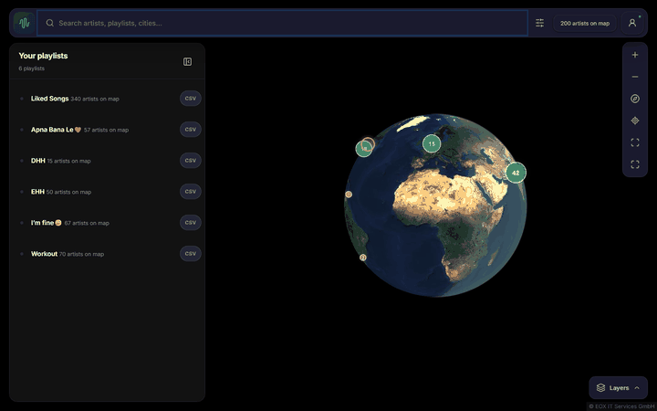
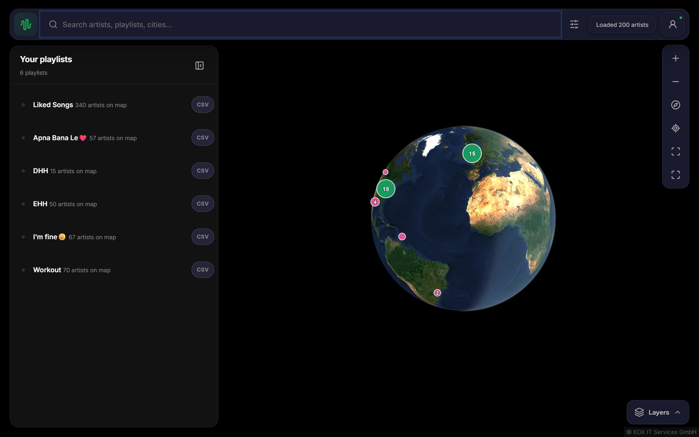
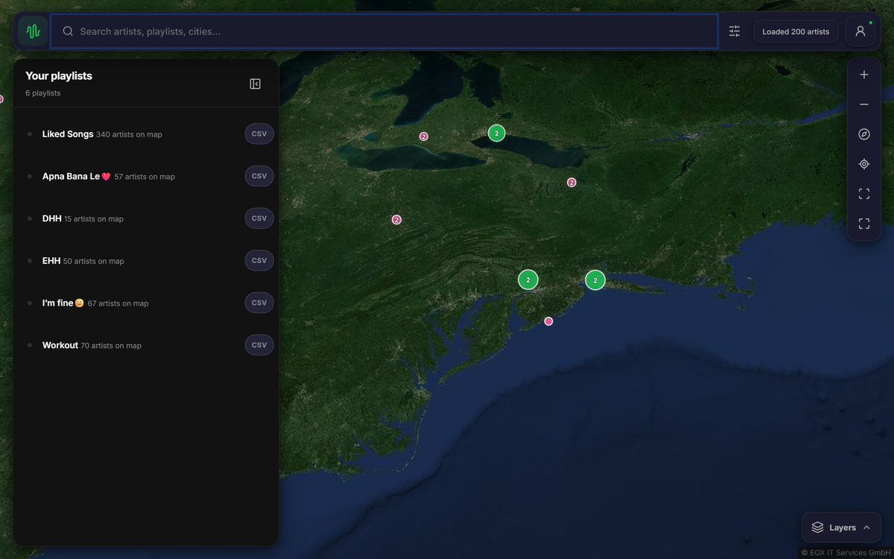
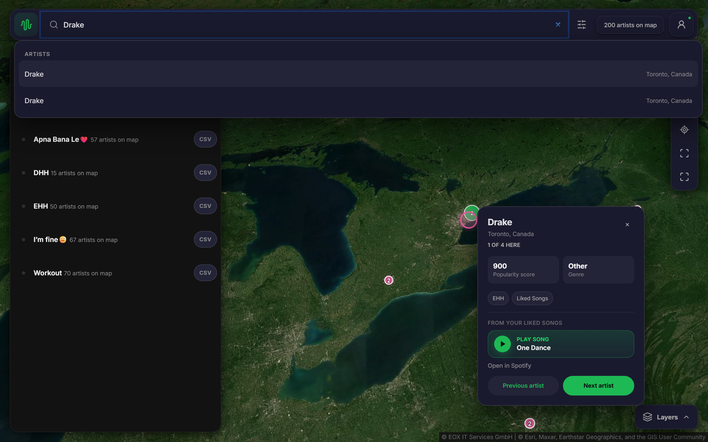

<p align="center">
  
</p>

# Sonic Cartography

**See where your music comes from.**

Your Spotify library, plotted on a living globe&mdash;every artist pinned to the city they came from, colored by genre, clustered as you explore.

⭐ **[Star this repo if you like it](https://github.com/myselfsiddharth/Spotify-Music-Map)**

<p align="center">
  <a href="#quick-start"></a>
  
  
  
  
</p>

<table>
  <tr>
    <td align="center" width="33%"><br><sub><b>Globe view</b></sub></td>
    <td align="center" width="33%"><br><sub><b>Cluster view</b></sub></td>
    <td align="center" width="33%"><br><sub><b>Artist detail card</b></sub></td>
  </tr>
</table>

---

## Features

- **Interactive globe & map** &mdash; Satellite globe, vector street map, and clean minimal. Zoom from space to street level.
- **One-click library pull** &mdash; Liked Songs and playlists, with smart rate-limit retry.
- **Genre-colored markers** &mdash; Hip-Hop, R&B/Soul, Pop, Indie, Rock, Electronic, Jazz, Reggae, Afrobeats, Latin.
- **Clustering & heatmap** &mdash; Nearby artists group as you zoom; density at a glance.
- **Search & filter** &mdash; Artist, city, country, playlist, or genre&mdash;combine freely.
- **Artist detail cards** &mdash; Origin, genre, playlists, and play a liked track in-browser.
- **Arcs & auto-spin** &mdash; Draw paths to your home, or let the globe spin.
- **CSV import/export** &mdash; [Exportify](https://exportify.net)-compatible; merge multiple sources.
- **Responsive** &mdash; Desktop, tablet, and mobile.

---

## Quick start

Every user brings their own Spotify API keys — Spotify apps in Development Mode can only be used by accounts their owner has allowlisted, so a shared key would not work for you anyway. Setup takes about a minute, and the app walks you through it on first launch.

### Prerequisites

- Python 3.9+
- A free [Spotify account](https://spotify.com) (Premium only matters for in-app playback)

### Install and run

```bash
git clone https://github.com/myselfsiddharth/Spotify-Music-Map.git
cd Spotify-Music-Map
pip install -r requirements.txt
python app.py
```

Open [http://127.0.0.1:5000](http://127.0.0.1:5000). The app opens on a setup screen that asks for your Spotify API keys — follow the steps below, paste them in, and it moves straight on to **Connect with Spotify**.

> Use `127.0.0.1`, not `localhost`. Spotify rejects `localhost` redirect URIs, and the two are different origins to your browser.

---

## Get your Spotify API keys

The keys identify *your* copy of the app to Spotify. They are free, take a minute, and nobody else ever sees them.

1. **Open the dashboard.** Go to the [Spotify Developer Dashboard](https://developer.spotify.com/dashboard) and log in with your normal Spotify account. Accept the Developer Terms if prompted.
2. **Create an app.** Click **Create app**. The name and description can be anything (for example, *My Sonic Cartography*).
3. **Add the Redirect URI.** In the **Redirect URIs** field, paste this exactly, then press **Add**:
   ```
   http://127.0.0.1:5000/api/auth/callback
   ```
   The setup screen in the app shows the exact URI for your machine — copy it from there if you run on a different port or host. It must match character for character, including `http://` and the trailing path.
4. **Select the API.** Tick **Web API** under *Which API/SDKs are you planning to use?*
5. **Save**, then open your new app and click **Settings**.
6. **Copy the keys.** The **Client ID** is shown on the page. Click **View client secret** to reveal the **Client secret**. Both are 32-character codes.
7. **Paste them into the app** on the setup screen and click **Save keys & continue**. The app verifies them with Spotify before accepting them, so a typo is caught immediately.

Your keys are held in this app's session cookie — the same place it keeps your Spotify OAuth tokens. They are never written into the repo, never logged, and never sent anywhere except Spotify. Click **Use different Spotify API keys** on the sign-in screen to change or remove them later, and see [SECURITY.md](SECURITY.md) for exactly how they are stored.

### Playing tracks and other accounts

A new Spotify app starts in **Development Mode**, which is all you need for yourself. If you want other people to sign in to your copy, add each of their Spotify accounts under **Settings → User Management** in the dashboard (up to 25).

### Optional: skip the setup screen with a `.env`

If you would rather configure the keys once on the server — useful for a private deployment or a machine you re-clone often — copy the template and fill it in. When these are set, the app starts at the Spotify sign-in screen instead.

```bash
cp .env.example .env
# Edit .env with your Spotify credentials
```

### Production

```bash
gunicorn wsgi:app --bind 0.0.0.0:5000
```

Use HTTPS in production so secure session cookies are enforced, and set `SPOTIFY_REDIRECT_URI` to your public callback URL.

---

## Troubleshooting

| Symptom | Fix |
|---|---|
| **INVALID_CLIENT: Invalid redirect URI** | The Redirect URI in your Spotify app doesn't match. Copy it from the app's setup screen and paste it into the dashboard exactly, including the port and `/api/auth/callback`. |
| **Spotify rejected these keys** | The Client ID or secret was mistyped or truncated. Re-copy both from **Settings** on your app's dashboard page. |
| **Login works, but the map is empty** | Spotify rate-limits new apps aggressively. Wait for the countdown shown in the status bar, or import an [Exportify](https://exportify.net) CSV in the meantime. |
| **Another account can't log in** | Add it under **Settings → User Management** in your Spotify app. |
| **Asked for keys again after restart** | Set `FLASK_SECRET_KEY` in `.env`, or let the app keep the `.flask_secret` file it generates in the project root. |

---

## How it works

```
Spotify OAuth  -->  Fetch Liked Songs + Playlist Tracks
                         |
                    Extract Artists
                         |
                  Wikidata SPARQL (concurrent batches)
                    P19 birthplace / P740 formation city
                         |
                    Geocode to lat/lng
                         |
                  Cache + Render on MapLibre Globe
```

1. **Authenticate** with Spotify (OAuth 2.0) using your own app keys
2. **Pull** Liked Songs and playlist tracks via Spotify Web API with retry/backoff
3. **Resolve** artist origins via Wikidata SPARQL (birthplace for solo artists, formation city for groups)
4. **Cache** results so return visits are instant
5. **Render** on a MapLibre GL globe with genre-colored clusters

---

## Environment variables

All of these are optional — without them, the app asks for your Spotify keys in the browser and generates a session key on first run.

| Variable | Description |
|---|---|
| `FLASK_SECRET_KEY` | Signs session cookies. Generated once into `.flask_secret` if unset |
| `SPOTIFY_CLIENT_ID` | From Spotify Developer Dashboard; skips the setup screen |
| `SPOTIFY_CLIENT_SECRET` | From Spotify Developer Dashboard; skips the setup screen |
| `SPOTIFY_REDIRECT_URI` | Must match your Spotify app settings. Defaults to the host you open the app on |
| `MUSICBRAINZ_CONTACT_EMAIL` | Contact email for MusicBrainz API (optional) |
| `PORT` | Server port (default: 5000) |

Keys entered through the setup screen take precedence over `SPOTIFY_CLIENT_ID` / `SPOTIFY_CLIENT_SECRET`, and are scoped to one browser session — two people using the same server each use their own Spotify app.

---

## Architecture

```
SpotifyMap/
├── app.py                        # Flask backend (API, Spotify, Wikidata)
├── sonic-cartography.html        # Single-page app shell
├── wsgi.py                       # Gunicorn entrypoint
├── requirements.txt              # Python dependencies
├── .env.example                  # Environment template
├── docs/assets/                  # README screenshots & demo GIF
├── static/
│   ├── css/
│   │   └── sonic-cartography.css # Responsive styles & themes
│   └── js/
│       ├── main.js               # App bootstrap & state
│       ├── setup.js              # First-run Spotify API key screen
│       ├── auth.js               # Spotify auth & data fetching
│       ├── map-controller.js     # MapLibre globe/map rendering
│       ├── ui.js                 # Search, filters, panels, detail cards
│       ├── filter-engine.js      # Client-side filtering & sorting
│       ├── data-store.js         # Reactive data state
│       ├── config.js             # Genre palette & constants
│       └── utils.js              # Geospatial utilities
└── spotify_origins.py            # Standalone CLI tool
```

### Backend

- **Flask** serves the API and static files
- **Spotipy** handles Spotify Web API with OAuth 2.0
- **Wikidata SPARQL** resolves artist origins with concurrent batch queries
- **Three-layer caching**: browser localStorage, server-side JSON, and origins cache

### Frontend

- **MapLibre GL JS** renders the GPU-accelerated globe with clustering, heatmap, and arcs
- **OpenFreeMap** provides vector basemaps (no API key required)
- **Esri World Imagery** powers the satellite globe view
- **Vanilla JS** (ES6 modules, no framework) keeps it lightweight and fast
- **Lucide** icons for a clean, modern interface

---

## Genre palette

| Genre | Color | Keywords |
|---|---|---|
| Hip-Hop | `#FF7A6B` | hip hop, rap, drill, trap, grime |
| R&B/Soul | `#F5B942` | r&b, soul, neo soul, funk, motown |
| Pop | `#FFD166` | pop, k-pop, singer-songwriter |
| Indie | `#9B7BFF` | indie, dream pop, shoegaze, lo-fi |
| Rock | `#E85D9E` | rock, metal, punk, grunge, emo |
| Electronic | `#4ECDC4` | house, techno, edm, ambient, trance |
| Afrobeats | `#5DD39E` | afrobeat, afropop, amapiano, highlife |
| Latin | `#FF9F45` | reggaeton, salsa, bachata, cumbia |
| Jazz | `#7FB2FF` | jazz, bossa, swing, bebop |
| Reggae | `#8BD450` | reggae, dancehall, dub, ska |

---

## API endpoints

| Endpoint | Method | Description |
|---|---|---|
| `/api/config/spotify` | GET | Whether API keys are set, and the redirect URI to register |
| `/api/config/spotify` | POST | Verify and save your Client ID / secret for this session |
| `/api/config/spotify` | DELETE | Forget saved API keys |
| `/api/auth/login` | GET | Initiate Spotify OAuth |
| `/api/auth/callback` | GET | OAuth redirect handler |
| `/api/auth/me` | GET | Current user profile |
| `/api/auth/logout` | POST | Clear session |
| `/api/library/sync` | POST | Sync top artists + liked songs |
| `/api/library/pull-playlists` | POST | Pull all playlists with retry/backoff |
| `/api/library/playlists` | GET | List playlist metadata |
| `/api/library/export-csv` | GET | Download Exportify-compatible CSV |
| `/api/library/import-csv` | POST | Import Exportify CSV files |
| `/api/library/liked-track` | GET | Look up liked track for an artist |

---

## CSV compatibility

Sonic Cartography reads and writes [Exportify](https://github.com/pavelkomarov/exportify)-compatible CSVs. You can:

- **Export** any playlist as CSV directly from the app
- **Import** CSVs from [exportify.net](https://exportify.net) or any Exportify-compatible source
- **Merge** multiple CSV imports onto a single map

---

## Performance

- **Concurrent Wikidata resolution** &mdash; Up to 4 parallel SPARQL batch queries
- **Rate-limit resilience** &mdash; Automatic retry with Retry-After backoff for Spotify API
- **Three-layer caching** &mdash; Browser localStorage + server JSON cache + origins cache means instant loads on return visits
- **Client-side filtering** &mdash; All search, filter, and sort operations happen in the browser with zero server round-trips
- **MapLibre clustering** &mdash; GPU-accelerated marker grouping for smooth rendering at any scale

---

## Contributing

Contributions are welcome. Please read **[CONTRIBUTING.md](CONTRIBUTING.md)** before opening a PR.

In short:

1. Fork, branch from `main`, and keep changes focused
2. **Run tests and make sure your solution works** (`pytest`, then manually verify in the app)
3. Never commit secrets or personal Spotify/cache data
4. Follow the [Code of Conduct](CODE_OF_CONDUCT.md)

Security issues: see [SECURITY.md](SECURITY.md) (do not file public issues for vulnerabilities).

### Automation on this repo

- **CI** &mdash; runs tests on every PR
- **CodeQL** &mdash; security analysis for Python and JavaScript
- **Dependency review** &mdash; blocks high-severity dependency changes on PRs
- **Dependabot** &mdash; weekly dependency and Actions updates
- **Release Drafter** &mdash; keeps a draft release notes PR changelog
- **Stale bot** &mdash; closes inactive issues/PRs (security and pinned issues are exempt)
- **Labeler** &mdash; auto-labels PRs by changed paths
- **First interaction** &mdash; greets first-time contributors

---

## Credits & licenses

- [MapLibre GL JS](https://github.com/maplibre/maplibre-gl-js) (BSD-3-Clause)
- [OpenFreeMap](https://github.com/hyperknot/openfreemap) (MIT)
- [OpenStreetMap](https://www.openstreetmap.org/copyright) (ODbL)
- Satellite imagery by [Esri](https://www.esri.com/) and partners
- [Wikidata](https://www.wikidata.org/) for artist origin data
- [Lucide](https://github.com/lucide-icons/lucide) icons (ISC)
- [Spotipy](https://github.com/spotipy-dev/spotipy) Spotify client (MIT)

---

<p align="center">
  Built by <a href="https://github.com/myselfsiddharth">Siddharth</a>
</p>
